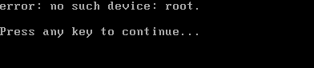

# How to export a GCP image to an Azure Image

## Fast Track
A usable image has already been created in VHD format and it lives at `s3://airwave-bigassbucket/elasticsearch-6-4-20211109.vhd`. If you need to create your own Azure image, skip down to [the Azure Upload section of this doc](#upload-to-azure-and-prep-it-for-usage).

## Create a VM instance from the original disk Image. 
* Use the disk image in GCP to create a new instance. 
https://console.cloud.google.com/compute/imagesDetail/projects/joses-sandbox/global/images/elasticsearch-6-3-2-minimal-v20190926?project=joses-sandbox


* use the default settings and Create the instance. 

### Log into the VM instance and prep the instance for local editing

* Open the sshd_config file : sudo vi /etc/ssh/sshd_config
* In the file, locate `PasswordAuthentication` and change the value to `yes`.
* In the same file, add `PermitRootLogin yes`.
* Restart the ssh service `sudo systemctl restart ssh`
* Create a password using `sudo passwd $whoami`
* Give yourself sudo privileges

### Get the Image out of GCP
* Stop the GCP VM instance

* Create an `Image` from `Storage > Disk` (not a Machine image, but Image). 


* Ensure the `Source disk` is correct and `Location` is `Multi-regional`


* Export the `VMDK` Image to Storage gcp://airwave-export-es-image 


* Goto Storage and download the exported VMDK image


## Manually edit the VMDK locally using VMWARE Workstation
* Create a new Virutal Machine
* Use the option for `existing disk` 
* Keep existing format
* Make sure the disk is using `IDE`

* Start the VM and log in

* If you see this error, disregard and wait. A login prompt will show. 



### Additional modifications
* Follow the manual steps listed out here:

```
sudo su - 
cp /etc/apt/sources.list /etc/apt/sources.list.bak
sed -i 's/http:\/\/us-.*1\.gce\.archive\.ubuntu\.com\/ubuntu\//http:\/\/azure\.archive\.ubuntu\.com\/ubuntu\//g' /etc/apt/sources.list
sed -i 's/http:\/\/gce.*\.archive\.ubuntu\.com\/ubuntu\//http:\/\/azure\.archive\.ubuntu\.com\/ubuntu\//g' /etc/apt/sources.list
apt update
```

* Install Azure Packages
```
apt install -y linux-azure linux-image-azure linux-headers-azure linux-tools-common linux-cloud-tools-common linux-tools-azure linux-cloud-tools-azure
apt install -y cloud-init netplan.io walinuxagent && systemctl stop walinuxagent
apt install -y udev
```
* Edit the grub file `vi /etc/default/grub` and edit:

```
GRUB_CMDLINE_LINUX_DEFAULT="console=tty1 console=ttyS0,115200n8 earlyprintk=ttyS0,115200 rootdelay=300 quiet splash"
```
```
update-grub
```
* More Edits
```

rm -f /etc/cloud/cloud.cfg.d/50-curtin-networking.cfg /etc/cloud/cloud.cfg.d/curtin-preserve-sources.cfg /etc/cloud/cloud.cfg.d/99-installer.cfg /etc/cloud/cloud.cfg.d/subiquity-disable-cloudinit-networking.cfg /etc/cloud/cloud.cfg.d/91-gce*
rm -f /etc/cloud/ds-identify.cfg
mv -f /etc/netplan/*.yaml ~/

```
* Fix the openssh conflict. Select `2. keep the local version currently installed`. 

```
apt remove -y openssh-server
apt install -y walinuxagent
```

* When creating the following files, make sure there are no additional line breaks, including the first line. 
```
cat > /etc/cloud/cloud.cfg.d/90_dpkg.cfg << EOF
datasource_list: [ Azure ]
EOF
vi /etc/cloud/cloud.cfg.d/90_dpkg.cfg
```
```
cat > /etc/cloud/cloud.cfg.d/90-azure.cfg << EOF
system_info:
   package_mirrors:
     - arches: [i386, amd64]
       failsafe:
         primary: http://archive.ubuntu.com/ubuntu
         security: http://security.ubuntu.com/ubuntu
       search:
         primary:
           - http://azure.archive.ubuntu.com/ubuntu/
         security: []
     - arches: [armhf, armel, default]
       failsafe:
         primary: http://ports.ubuntu.com/ubuntu-ports
         security: http://ports.ubuntu.com/ubuntu-ports
EOF
vi /etc/cloud/cloud.cfg.d/90-azure.cfg
```
```
cat > /etc/cloud/cloud.cfg.d/10-azure-kvp.cfg << EOF
reporting:
  logging:
    type: log
  telemetry:
    type: hyperv
EOF
vi /etc/cloud/cloud.cfg.d/10-azure-kvp.cfg
```
* Update the waagent.conf so you are using cloud-init
```
sed -i 's/Provisioning.Enabled=y/Provisioning.Enabled=n/g' /etc/waagent.conf
sed -i 's/Provisioning.UseCloudInit=n/Provisioning.UseCloudInit=y/g' /etc/waagent.conf
sed -i 's/ResourceDisk.Format=y/ResourceDisk.Format=n/g' /etc/waagent.conf
sed -i 's/ResourceDisk.EnableSwap=y/ResourceDisk.EnableSwap=n/g' /etc/waagent.conf

cat >> /etc/waagent.conf << EOF
# For Azure Linux agent version >= 2.2.45, this is the option to configure,
# enable, or disable the provisioning behavior of the Linux agent.
# Accepted values are auto (default), waagent, cloud-init, or disabled.
# A value of auto means that the agent will rely on cloud-init to handle
# provisioning if it is installed and enabled, which in this case it will.
Provisioning.Agent=auto
EOF
```

* Clean up
```
cloud-init clean --logs --seed
rm -rf /var/lib/cloud/
systemctl stop walinuxagent.service
rm -rf /var/lib/waagent/
rm -f /var/log/waagent.log
```

* Run the following commands: 
```
waagent -force -deprovision+user
rm -f ~/.bash_history
export HISTSIZE=0
logout
```

* Shut down the VM

Reference documentation: 
* https://docs.microsoft.com/en-us/azure/virtual-machines/linux/create-upload-ubuntu#manual-steps
* https://docs.microsoft.com/en-us/azure/migrate/tutorial-migrate-gcp-virtual-machines


## Image Conversion
* Get StarwindConverter from s3://airwave-bigassbucket/


## Test the VHD in Hyper-V
* Create a new Machine with existing disk pointing to the VHD
* Choose Generation 1
* The VM should come up within 30 seconds
* check for ssh `sudo systemctl status ssh`
* `sudo apt remove linux-image-gcp`
* `sudo apt remove linux-image-4.15.0-1044-gcp`
* remove your sudo access
