## Upload Image to Azure and prep it for usage
* Once you have the VHD file, navigate to `Storage Accounts` and choose a Storage Account that matches the region you are going to provision to. If one doesn't exist, just create it. 
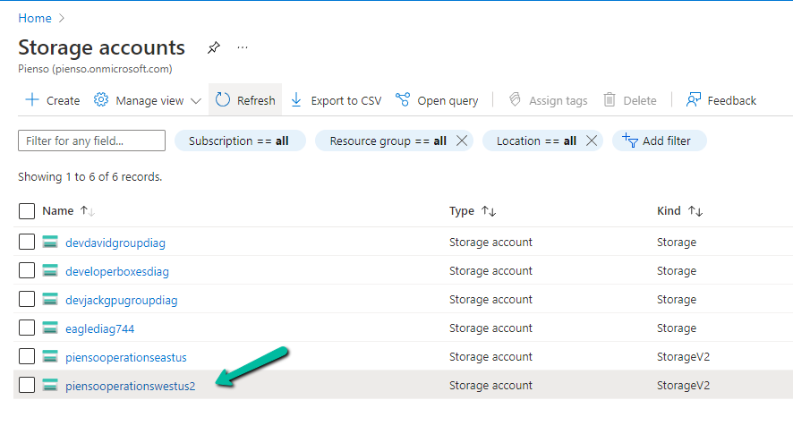

* Select `Containers` and click on the container shown. If a container doesn't exist, just create it. 
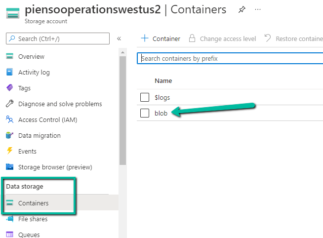

* Upload the file as a `Page Blob`
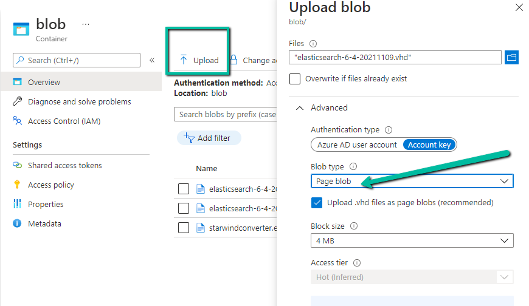

* Navigate to `Images` in the Azure console and create an Image. Be mindful of the various options shown in the image below. 
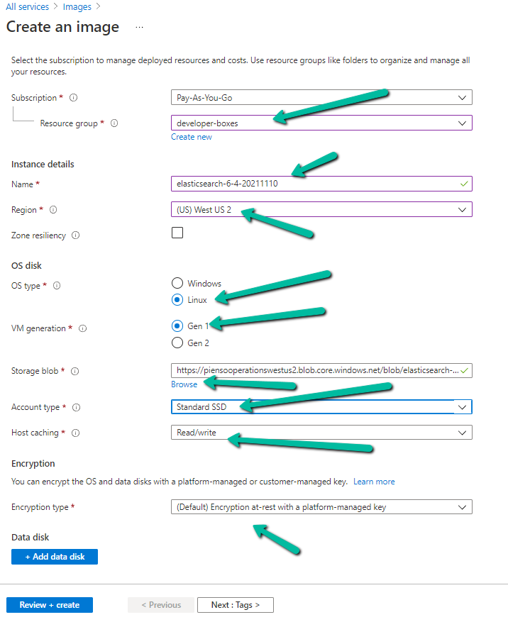

## Adding the Image to a Shared Gallery
* Click on the image and select `Clone to a VM Image`
https://azure.microsoft.com/en-us/resources/templates/sig-create/
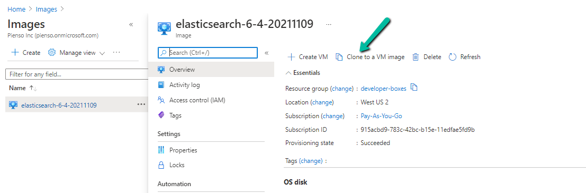
* Be mindful for the `Resource Group`, `Version number` and `End of life date`
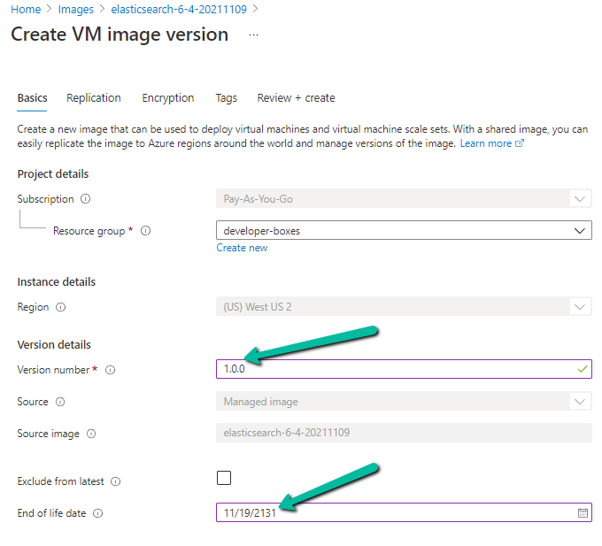
* Create a new Azure Compute Gallery
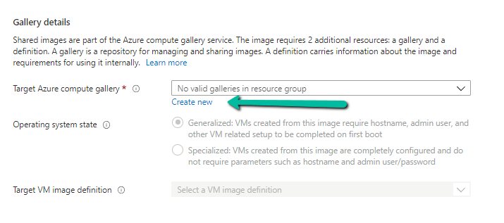
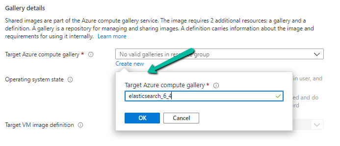
* Create a new VM Image Definition
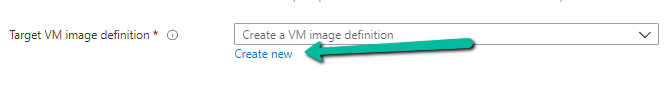
* Fill in the `VM image definition name`, `Publisher`, `Offer` and `SKU` as shown in the image
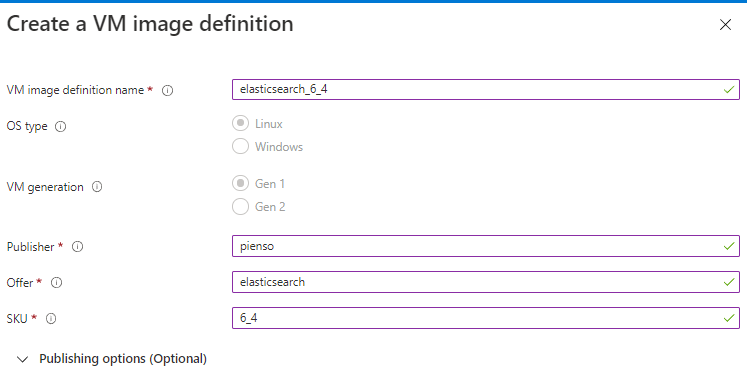
* Click on `Next: Replication`. Check on the `Default Storage sku`, `Default Replica Count` and add `Target regions` to the regions you want this to be available in. 
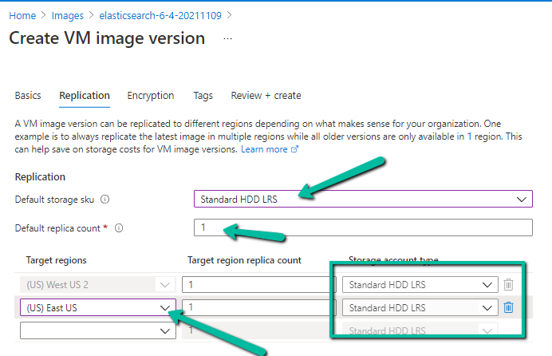
* Click on `Next: Encryption`
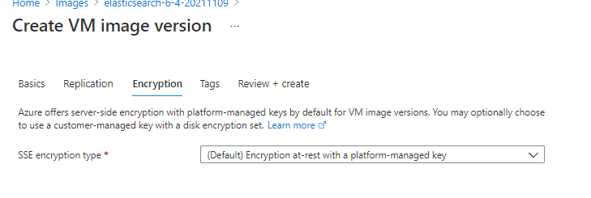
* Click on `Review + create` and then `Create`
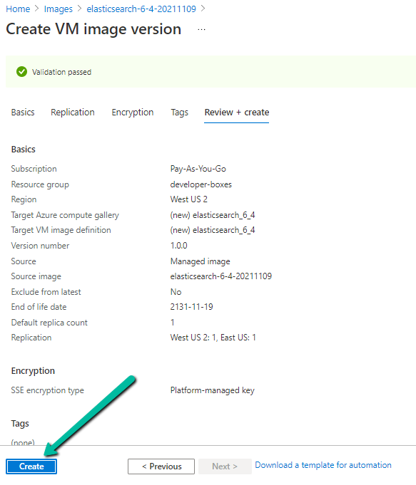

## Adding permissions to the Shared Image
* In the Azure console, navigate to `Azure Compute Galleries > elasticsearc_6_4 > Access control (IAM)`
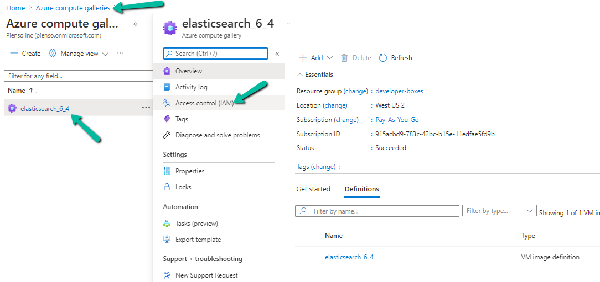
* Click on `Add role assignment`
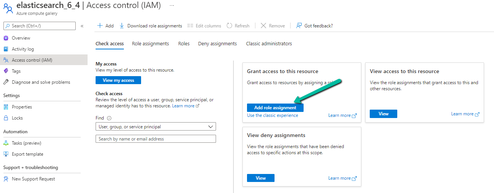
* Click on `Owner` so it is selected
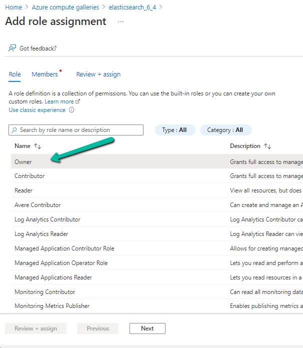
* Click on `Members` and `Select members`
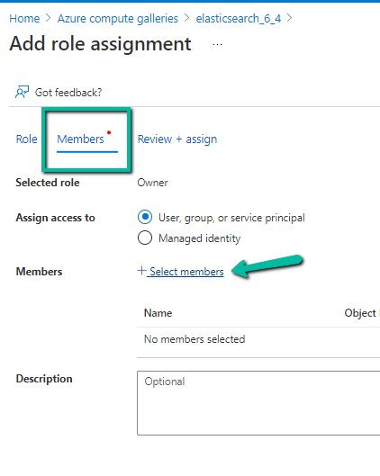
* Add groups and people that you wish to give access to and click `Select`
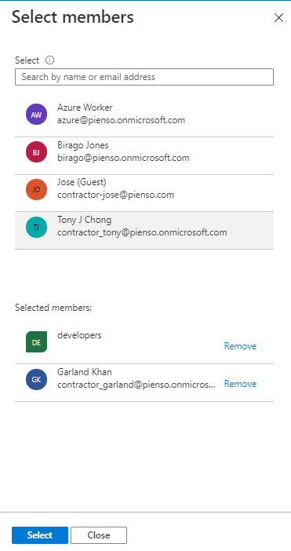
* Review + assign

## Get the Resource ID of the Image to use for Terraform
* Once that task is finished, goto the `Azure computer galleries > elasticsearch_6_4 > click on  Definition 'elasticsearch_6_4'`
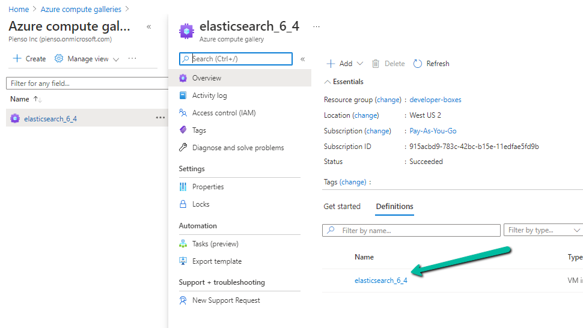
* Click on `Properties` and grab the `Resource ID`. This is what you will need in Terraform. 
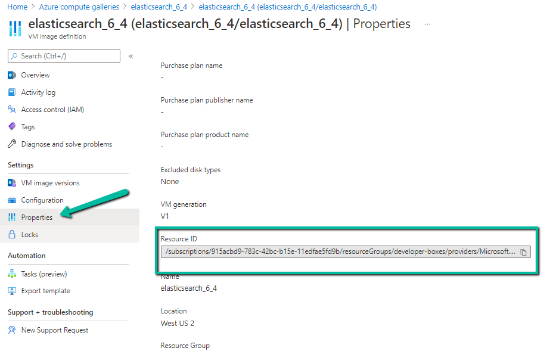

