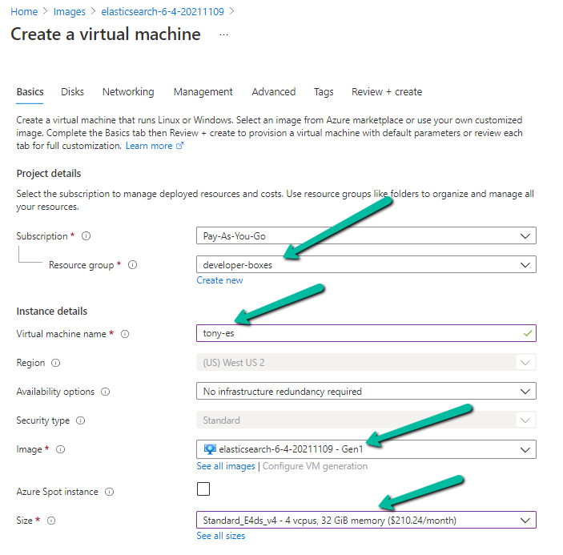
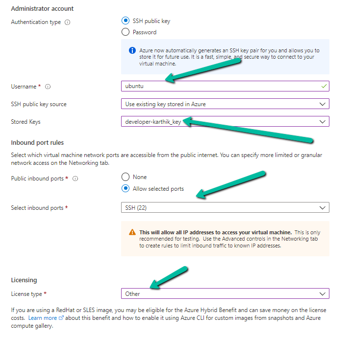
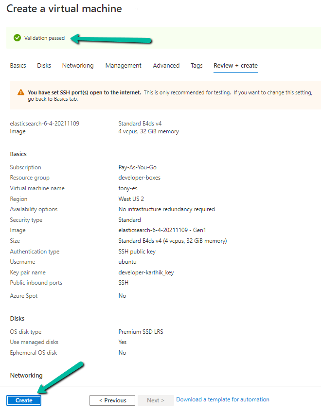

## Creating the VM manually (You should be using Terraform)
When creating the VM, be mindful of the following settings:

* Resource Group
* Virtual Machine Name
* Image
* Size
* Administrator account (authentication type)
* Inbound port rules
* Licensing

Click on `Review + create`
* Ensure the Validation passed
* Create
