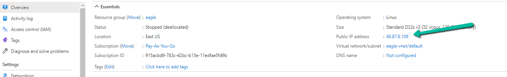

## Connect via SSH to the Elasticsearch VM
Like other VMs in the stack, the `ubuntu` user will be created and will be associated to the `var.public_key` value you specify in the Terraform resource. When the Elasticsearch vm is created, you can ssh using the public IP assigned to it.
* You can get the public IP by either looking at the Terraform output `elasticsearch_public_ip_address`, or in the `Azure Console > Virtual Machines > ES Machine > Overview > Public IP address`

***Note*** The above image is example screenshot of where the Public IP address is in the Azure console. 

* SSH into the machine. The private key will be the corresponding key of the `var.public_key` you specified in the resource when provisioning the VM. 

```ssh -i <path/of/private_key> ubuntu@<public IP>```

From there, you can sudo as any user, including `root`. 

## To verify Elasticsearch is running
* Elasticsearch should auto-start on boot / reboot.
* After SSHing into the machine, you can run `sudo systemctl status elasticsearch` to see the status of Elasticsearch. The result should net a similar output as below. Take note that it is `enabled` and is `Active: active (running)`
```
● elasticsearch.service - Elasticsearch
   Loaded: loaded (/usr/lib/systemd/system/elasticsearch.service; enabled; vendor preset: enabled)
   Active: active (running) since Sun 2021-11-21 23:22:43 UTC; 5min ago
     Docs: http://www.elastic.co
 Main PID: 859 (java)
    Tasks: 50 (limit: 4915)
   CGroup: /system.slice/elasticsearch.service
           ├─ 859 /usr/bin/java -Xms10g -Xmx10g -XX:+UseConcMarkSweepGC -XX:CMSInitiatingOccupancyFraction=75 -XX:+UseCMSInitiatingOccupancyOnly -XX:+AlwaysPreTouch -Xss1m -Djava.awt.headless=true -Dfile.encoding=UTF-8 -Djna.nosys=true -XX:-OmitStackTraceInFastThrow -D
io.netty.noUnsafe=true -Dio.netty.noKeySetOptimization=true -Dio.netty.recycler.maxCapacityPerThread=0 -Dlog4j.shutdownHookEnabled=false -Dlog4j2.disable.jmx=true -Djava.io.tmpdir=/tmp/elasticsearch.mbU9d7Yg -XX:+HeapDumpOnOutOfMemoryError -XX:HeapDumpPath=/var/lib/ela
sticsearch -XX:ErrorFile=/var/log/elasticsearch/hs_err_pid%p.log -Xlog:gc*,gc+age=trace,safepoint:file=/var/log/elasticsearch/gc.log:utctime,pid,tags:filecount=32,filesize=64m -Djava.locale.providers=COMPAT -XX:UseAVX=2 -Des.path.home=/usr/share/elasticsearch -Des.path
.conf=/etc/elasticsearch -Des.distribution.flavor=default -Des.distribution.type=deb -cp /usr/share/elasticsearch/lib/* org.elasticsearch.bootstrap.Elasticsearch -p /var/run/elasticsearch/elasticsearch.pid --quiet
           └─1508 /usr/share/elasticsearch/modules/x-pack/x-pack-ml/platform/linux-x86_64/bin/controller

Nov 21 23:22:43 elasticsearch-test-123 systemd[1]: Started Elasticsearch.
Nov 21 23:22:49 elasticsearch-test-123 elasticsearch[859]: OpenJDK 64-Bit Server VM warning: Option UseConcMarkSweepGC was deprecated in version 9.0 and will likely be removed in a future release.
```
* Verify the Elasticsearch application is running by issuing the command `curl localhost:9200`.  The result should net a similar output as below:

```
{
  "name" : "master-single",
  "cluster_name" : "airwave-es",
  "cluster_uuid" : "cJRilBGNTCKaX_Iehd4asA",
  "version" : {
    "number" : "6.3.2",
    "build_flavor" : "default",
    "build_type" : "deb",
    "build_hash" : "053779d",
    "build_date" : "2018-07-20T05:20:23.451332Z",
    "build_snapshot" : false,
    "lucene_version" : "7.3.1",
    "minimum_wire_compatibility_version" : "5.6.0",
    "minimum_index_compatibility_version" : "5.0.0"
  },
  "tagline" : "You Know, for Search"
}
```